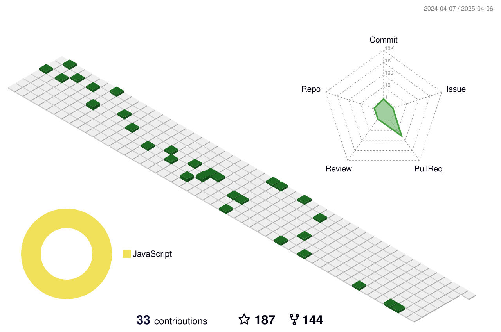

<p>
  
<p>
  <!-- IDE & Tools -->
  
  
  
  
  
  

  <!-- Languages -->
  
  
  
  
  

  <!-- Frameworks & Libraries -->
  
  
  
  
  
  

  <!-- Database -->
  

  <!-- Testing -->
  
</p>
</p>
<p>
  📣 Want to get in touch? Reach out here:<br/>
  <a href="mailto:richmantan0@gmail.com?subject=[GitHub]%20🔥%20Let’s%20Connect&body=Hi%20Richman%2C%0A%0AI%20found%20your%20GitHub%20profile%20and%20wanted%20to%20reach%20out%20regarding...">
    
  </a>
  <a href="https://linkedin.com/in/richman-tan">
    
  </a>
  <a href="https://github.com/richmantan">
    
  </a>
</p>
<!-- <p>
  🎶Now playing ...🎶<br/>
  <a href="http://spotify-informer.daniels-roth-stan.fr/">
    
  </a><br/>
  <a href="https://github.com/MrStanDu33/spotify-informer"></a><br/>
</p> -->

<!--  -->

<h3>⚡️ Building with Code & Curiosity ⚡️</h3><br/>

<p>
  👋 I'm <b>Richman Tan</b>, a penultimate-year Software Engineering student based in <a href="https://www.google.com/maps?q=auckland">Auckland, New Zealand</a> 🇳🇿.<br/>
  💻 Passionate about all things full-stack, machine learning, and game development.<br/>
  🌱 Currently diving deeper into <b>Spring Boot</b>, <b>PyTorch</b>, and creative UI/UX design.<br/>
  🛠️ Skilled in <b>React</b>, <b>Flask</b>, <b>Java</b>, <b>Python</b>, and more.<br/>
  🎓 Hackathon finalist, educational game developer, and active member of the tech community.
</p>
<p>
  🔗 Looking to collaborate or just say hi? Drop me an <a href="mailto:richmantan0@gmail.com?subject=[GitHub]%20🔥%20Let’s%20Connect&body=Hi%20Richman%2C%0A%0AI%20found%20your%20GitHub%20profile%20and%20wanted%20to%20reach%20out%20regarding...">email</a> or check out my <a href="https://linkedin.com/in/richman-tan">LinkedIn</a>!
</p><br/>



<details>
  <summary>Some stats...</summary><br/>

<!--START_SECTION:waka-->


**🐱 My GitHub Data** 

> 📦 2.5 MB Used in GitHub's Storage 
 > 
> 🏆 3 Contributions in the Year 2025
 > 
> 💼 Opted to Hire
 > 
> 📜 41 Public Repositories 
 > 
> 🔑 10 Private Repositories 
 > 
**I'm an Early 🐤** 

```text
🌞 Morning                3092 commits        ██░░░░░░░░░░░░░░░░░░░░░░░   07.97 % 
🌆 Daytime                18438 commits       ████████████░░░░░░░░░░░░░   47.54 % 
🌃 Evening                13862 commits       █████████░░░░░░░░░░░░░░░░   35.74 % 
🌙 Night                  3395 commits        ██░░░░░░░░░░░░░░░░░░░░░░░   08.75 % 
```
📅 **I'm Most Productive on Wednesday** 

```text
Monday                   6180 commits        ████░░░░░░░░░░░░░░░░░░░░░   15.93 % 
Tuesday                  6611 commits        ████░░░░░░░░░░░░░░░░░░░░░   17.04 % 
Wednesday                8276 commits        █████░░░░░░░░░░░░░░░░░░░░   21.34 % 
Thursday                 6487 commits        ████░░░░░░░░░░░░░░░░░░░░░   16.72 % 
Friday                   5326 commits        ███░░░░░░░░░░░░░░░░░░░░░░   13.73 % 
Saturday                 2810 commits        ██░░░░░░░░░░░░░░░░░░░░░░░   07.24 % 
Sunday                   3097 commits        ██░░░░░░░░░░░░░░░░░░░░░░░   07.98 % 
```


📊 **This Week I Spent My Time On** 

```text
🕑︎ Time Zone: Europe/Paris

💬 Programming Languages: 
Vue.js                   3 hrs 15 mins       ███████████░░░░░░░░░░░░░░   45.33 % 
TypeScript               1 hr 55 mins        ███████░░░░░░░░░░░░░░░░░░   26.75 % 
SCSS                     57 mins             ███░░░░░░░░░░░░░░░░░░░░░░   13.38 % 
HTML                     22 mins             █░░░░░░░░░░░░░░░░░░░░░░░░   05.25 % 
JSON                     22 mins             █░░░░░░░░░░░░░░░░░░░░░░░░   05.21 % 

🔥 Editors: 
VS Code                  7 hrs 1 min         ████████████████████████░   97.52 % 
Zsh                      10 mins             █░░░░░░░░░░░░░░░░░░░░░░░░   02.48 % 

💻 Operating System: 
Mac                      5 hrs 20 mins       ███████████████████░░░░░░   74.14 % 
WSL                      1 hr 51 mins        ██████░░░░░░░░░░░░░░░░░░░   25.86 % 
```

**I Mostly Code in JavaScript** 

```text
JavaScript               10 repos            ███████░░░░░░░░░░░░░░░░░░   27.03 % 
PHP                      10 repos            ███████░░░░░░░░░░░░░░░░░░   27.03 % 
HTML                     8 repos             █████░░░░░░░░░░░░░░░░░░░░   21.62 % 
Vue                      5 repos             ███░░░░░░░░░░░░░░░░░░░░░░   13.51 % 
CSS                      3 repos             ██░░░░░░░░░░░░░░░░░░░░░░░   08.11 % 
```


 Last Updated on 07/04/2025 00:07:40 UTC
<!--END_SECTION:waka-->
</details>
